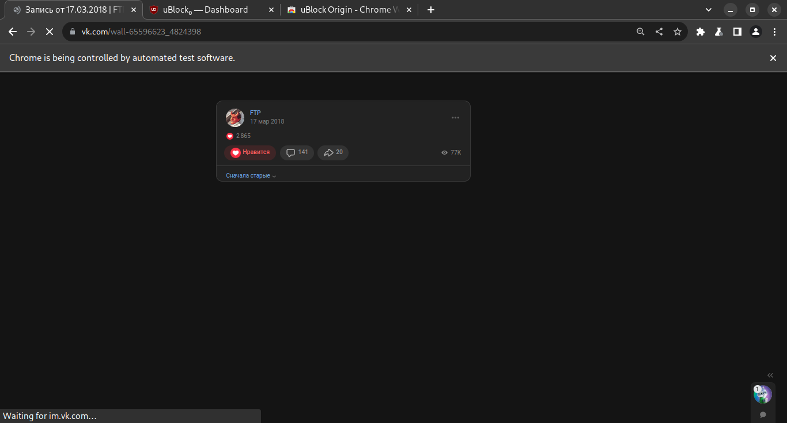

## Что делает

Удаляет информацию о пользователе из вконтакта:
1. Снимает лайки
1. Удаляет комментарии
1. Очищает видео
1. Очищает музыку
1. Снимает отметки на фото
1. Выходит из групп

## Важно знать

### По работе скрипта:

* Удалить данные из закрытых групп, к которым нет доступа; удаленных постов и т.п. - на данный момент невозможно впринципе, даже через техподдержку.

* Автор не гарантирует полную очистку данных - возможно некоторые данные придется дочищать вручную. По крайней мере, после первой очистки следует запросить архив данных заново и запустить очистку второй раз.

* Если ВК начал заваливать капчами (капча на каждой странице), следует подменить IP через прокси или VPN. В ином случаее - остановить скрипт и продолжить удаление на следующий день. Останавливать скрипт следует закрытием браузера - в консоли упадет ошибка и прогресс сохранится. При следующем запуске прогресс продолжится со страницы с ошибкой.

* Нужно учесть, что на очищение данных суммарно может уйти более суток.

* Неизвестно, как ведет себя скрипт, если свернуть рабочий браузер. Автор не тестировал данный вариант, можете сделать это сами. Тем не менее рекомендуется следить за выполнением скрипта, хотя бы в пол глаза. Если есть возможность, можно поставить выполнение на второй монитор, а на первом, например, смотреть ютуб. Плюс придется вводить капчи время от времени.

### По проекту:

* Серьезное развитие проекта не планируется, т.к. автору удалять больше нечего, соответственно тестировать код негде. Но пулл реквесты и багрепорты приветствуются, правда тестировать все равно придется вам.

* API не используется (и не будет), т.к. он ужасен - 2000 операций в день это крайне мало. Причем после снятия 3 лайков сразу требуется капча.

## Как пользоваться

### Требования для запуска:

* Должен быть установлен [Node.js](https://nodejs.org/en/download/).

* В проекте используется архив данных ВК - запросить его можно [тут](https://vk.com/data_protection?section=rules&scroll_to_archive=1), рекомендуется поставить все галочки. На сбор данных может уйти несколько дней, поэтому следует позаботиться об этом заранее.

* Установить браузер [Chrome](https://www.google.com/chrome/). Желательно отключить браузеру автоматические обновления на время удаления данных.

* Windows: Скачать [Selenium Chrome Driver](https://www.selenium.dev/documentation/webdriver/getting_started/install_drivers/) для вашей версии хрома. Распаковать его в директорию, допустим `C://SeleniumDrivers`. Добавить директорию в PATH ([видео](https://www.youtube.com/watch?v=mqIgUbpSz_A)).
* Linux: установить google-chrome через ваш пакетный менеджер. В файл `.bashrc` / `.zshrc` / `.fishrc` добавить сторочку:
  
  `export PATH=$PATH:/usr/bin` - для стандартного пакета Chrome (.deb, .rpm, AUR)
  
  `export PATH=$PATH:/var/lib/flatpak/exports/bin` - для Flatpak пакета
  
  `export PATH=$PATH:/snap/bin` - для Snap пакета

### Порядок действий:

1. Склонировать проект.

1. Выполнить `npm install` в терминале, в директории проекта.

1. Переименовать файл `.env.template` в `.env`.

1. Ввести свои логин и пароль в файле `.env` (вход только по номеру телефона на данный момент не реализован)
   * Для Linux следует открыть Chrome и залогиниться вручную.

1. Скопировать распакованный архив данных в директорию проекта. Полный путь к файлу `index.html` из архива должен выглядеть так: `<путь_к_проекту>/Archive/index.html`.

1. Запустить скрипт командой в терминале `npm start`.

1. Когда ВК запросит капчу - нужно ее ввести вручную.

Если нужно завершить работу (например, выключить ПК на ночь) - закройте браузер и подождите. В терминале отобразится ошибка, и сообщение о том, что данные сохранены, после этого можно завершать работу.

Все данные о работе будут сохранены в директорию reports.

## Оптимизация

Чтобы ускорить процесс удаления лайков / комменатриев скачайте расширение [uBlock origin](https://chrome.google.com/webstore/detail/ublock-origin/cjpalhdlnbpafiamejdnhcphjbkeiagm), зайдите в настройки и во вкладке My Filters / Мои фильтры импортируйте файл my-ublock-static-filters.txt из папки ublock. После этих действий страница VK будет представлять из себя только пост без интерфейса, картинки и комментариев. Такая страница будет загружаться намного быстрее.

## Поддержка

Если проект вам помог, то вы можете [поддержать автора](https://github.com/ColdSpirit0/ColdSpirit0/blob/main/donate.md).
